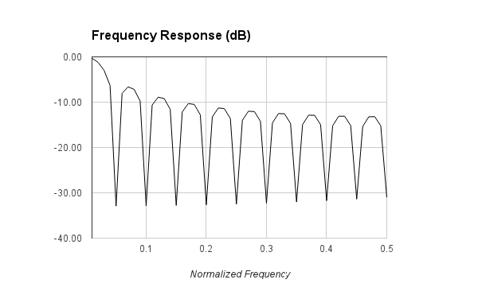

Bike Light
=========

The goal of this project is to explore real world applications of accelerometers by designing an bycicle tail light that can light up when the bycicle is slowing down. There are commercial products that do this and at least according to their demo videos seem to work properly, so I have set on a quest to reproduce the device and get it to work in a satisfactory way.

The picture below shows the prototype used. The larger board is an Arduino Mini and the smaller one is an accelerometer breakout board. The green LED is just there to drop the voltage close to the 3.3V required as I didn't have any regulator handy. The actual brake light LED is the clear one visible on the bottom.

Challenges
==========

The output of an accelerometer is far from clean and, even more so, when riding on rough road of off-road. A first naive attempt to just just get an idea was just reading acceleration in the direction of travel and light an LED when this was below zero or a certain threshold. Needless to say results were awful with the LED randomly blinking at every bump on the road.

Running Average Filter
==========

A running average is a smoothing process that is achieved by averaging the last n samples of a signal. This also has a low pass frequency response when seen in frequency domain. Unfortunately this type of filter doesn't have a very good freuency response, a rather slow roll off and a poor out of band rejection. I wanted to give it a try anyway as it's exrremely simple to implement and it might be sufficient for this type of application. I tryed to shoot first for a 1Hz 3dB cut-off frequency. The normalized frequency response for a running average filter of length N can be calculated as:

For a filter length N=20 the normalized frequency response looks like this:

So we can expect an out of band rejection of roughly 10dB. By calculating values for the above formula we also see that the -3dB cut-off happens at a normalized frequency of 0.03. So I choose a sampling frequency of 40Hz that places the cut-off at 1.2Hz with filter length N=20.

It should be noted that the longer the filter the steeper the roll off. A longer filter requires also an higer sampling frequency to achieve the same cut-off frequency.

So, for a first experiment, I decided to go with a sampling frequency of 40Hz, filter length N=20 expecting a 3dB cut-off at 1.2Hz which seems adequate to filter out road bumps. Results were not bad in road tests with the LED lighting up at every brake except the slowest ones. Results were not excellent though and often potholes and rough roads caused the light to intermmitently come up.

FIR Filter
============

A filter with a better frequency response is a FIR (Finite Impulse Response) filter. This is basically a convolution of the sampled signal with a set of pre-calculated values known as taps. As usual there are trade-off between the filter length (amount of taps) and the frequency response. 

I kept the original target to shoot for a 1Hz low pass filter and used this online tool to calcullate the filter taps (http://t-filter.appspot.com/fir/index.html). In an attempt to reduce the amount of taps I kept the sampling frequency low at 10Hz so that I could get the 1Hz low pass with just 15 taps. The frequency response as plotted on the mentioned site can be seen below:

Calibration
============

The chosen accelerometer type outputs the read values as an analog value, for this reason calibration is needed to convert such values, once sampled, to actual acceleration. For this system a simple calibration procedure has been chosen that uses earth gravity as reference. When the device is placed in calibration mode it will simply read all axes acceleration for 10 seconds and store the maximum and minimum values read for each axis. The operator is supposed to slowly rotate the device on all 6 sides so that each axis is exposed to accelerations of +1g to -1g. Of course this system is not optimal and requires to move the device slowly during calibration. Results can be verified after calibration ensuring +1g and -1g values are reported for all axes.

